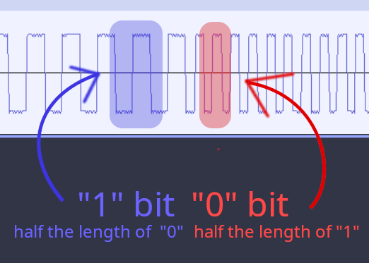
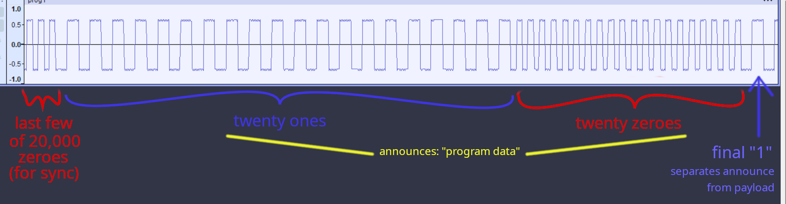

# Family BASIC Internal Details

This document presents details about some of the inner workings of Family BASIC. See also [BUGS](BUGS.md), for bugs and surprising code choices.

## BASIC Program In-Memory Representation

The start of the storage area for (tokenized) BASIC program text is indicated by the variable [zpTXTTAB](https://famibe.addictivecode.org/disassembly/fb3.nes.html#SymzpTXTTAB) ($05.06). Family BASIC initializes this to `$6006` (in cartridge RAM, battery-backed&mdash;in this case by a pair of literal AA batteries), and never changes from that. (Family Basic v2 has it set to `$703E`, instead.) It's possible that a BASIC program might be able to modify Family BASIC's understanding of where the program starts and re-run, providing reliable space for some machine-language code to live in "LOMEM" (Note: `LOMEM` is not a keyword or special variable name used by Family BASIC).

The end of the program is tracked by [zpTXTEND](https://famibe.addictivecode.org/disassembly/fb3.nes.html#SymzpTXTEND) ($07.$08).

### Line Linkage

A line of BASIC code is represented as:
 1. A single byte indicating the offset from this position to the start of the next line of the program - that is, the number of bytes from this offset byte to the offset byte of the next line. Alternatively, it is 4 more than the *length* of the tokenized line (accounting for this byte, the two that follow it, and a terminating null character). If you have a pointer to this byte, add its value and you now have a pointer to the next line.
 2. A word containing the line number.
 3. The tokenized line contents.
 4. A terminating null byte (`$00`).

Note that the maximum length of a program line is 251 characters. If a user types a (numbered) line longer than this, Family BASIC will silently truncate it to fit.

Some related starting points: [DirectModeLoop](https://famibe.addictivecode.org/disassembly/fb3.nes.html#SymDirectModeLoop), where user lines are read in via [ReadLine](https://famibe.addictivecode.org/disassembly/fb3.nes.html#SymReadLine), which reads the line into [lineBuffer](https://famibe.addictivecode.org/disassembly/fb3.nes.html#SymLineBuffer) (`$500`) and, if numbered, sent along to [ProcessNumberedLine](https://famibe.addictivecode.org/disassembly/fb3.nes.html#SymProcessNumberedLine). The line gets [Tokenize](https://famibe.addictivecode.org/disassembly/fb3.nes.html#SymTokenize)d and stored in [tokenizeBuffer](https://famibe.addictivecode.org/disassembly/fb3.nes.html#SymtokenizeBuffer) (`$300`), any existing line with the same number gets deleted by [TxtDeleteLine](https://famibe.addictivecode.org/disassembly/fb3.nes.html#SymTxtDeleteLine), and then it gets inserted into its spot via [TxtInsertLine](https://famibe.addictivecode.org/disassembly/fb3.nes.html#SymTxtInsertLine), which finds its spot using [FindLineNum](https://famibe.addictivecode.org/disassembly/fb3.nes.html#SymFindLineNum).

### Tokenizing

Tokenization starts at [Tokenize](https://famibe.addictivecode.org/disassembly/fb3.nes.html#SymTokenize). [TokenizeKeyword](https://famibe.addictivecode.org/disassembly/fb3.nes.html#SymTokenizeKeyword) handles tokenizing keywords (*gasp!*), looking them up in [tbl_KeywordTokens](https://famibe.addictivecode.org/disassembly/fb3.nes.html#Symtbl_KeywordTokens) to swap them for token bytes. This table consists of a token byte (high bit is always set), followed by the keyword (high bit always unset). The table terminates with a `#$FF` byte.

If a keyword token is identified, it stores the token and then additionally checks if the keyword requires special token handling beyond this point (`REM` and `DATA` being obvious cases, but also any commands that accept line numbers as arguments, as these are tokenized differently from other numbers; see [Tokenized Numbers](#tokenized-numbers), immediately below).

#### Abbreviated Keywords

Family BASIC has a unique (as far as I know?) feature in that keywords can be abbreviated by typing in only an initial portion of the keyword, and then following it with a period. For instance, `PR.` instead of `PRINT`. The official abbreviations are listed together with their commands, near the back of the Family BASIC instruction manual. Abbrevations are implemented quite simply: if it encounters a period character in the input at any point while checking for a keyword match, it automatically accepts the keyword currently being checked, and inserts that token. For instance, if the tokenizer sees a "P", it will walk down the [tbl_KeywordTokens](https://famibe.addictivecode.org/disassembly/fb3.nes.html#Symtbl_KeywordTokens) table, rejecting all the keywords that don't begin with a `"P"`, until it gets to `"PRINT"`, the first keyword in the table that begins with that letter. If it then encounters a period `"."` in the input stream, it will immediately accept the current keyword, since it hadn't been rejected up to that point. Of course, `PRINT` already has an even shorter abbreviation, the question mark `?`.

Note that keyword searching is *not* done in alphabetical order, but by the order it appears in [tbl_KeywordTokens](https://famibe.addictivecode.org/disassembly/fb3.nes.html#Symtbl_KeywordTokens) (which will also correspond to ordering by token byte value). and so if multiple keywords would have matched the abbreviation you've typed so far, there's no guarantee that it will be tokenized as the lexically first of those words. This is why the manual offers recommended abbreviations.

#### Tokenized Numbers

When multi-digit, integer numbers are encountered, they are converted from decimal via [TokenizeNumber](https://famibe.addictivecode.org/disassembly/fb3.nes.html#SymTokenizeNumber) (or hexadecimal via [TokenizeHexNum](https://famibe.addictivecode.org/disassembly/fb3.nes.html#SymTokenizeHexNum), if preceded by `&`) to binary, and preceded by a special signifier byte, which is normally `#$12` if the number was in decimal, or `#$11` if it was hexadecimal (for redisplay purposes by `LIST`).

When a single-digit number is encountered, it is handled a little differently by [TokenizeNumber](https://famibe.addictivecode.org/disassembly/fb3.nes.html#SymTokenizeNumber): the number is incremented (so it goes from a value of 0-9, to a value of 1-10), and is then stored directly in the token stream. (The increment is to ensure we don't end up with the null terminating byte; it is re-decremented before display or interpretation.) (This format for single-digit numbers is not used by Family BASIC v2.)

When a keyword is recognized and converted into a token, the tokenizer hands off to [StoreTokenAndHandleArgs](https://famibe.addictivecode.org/disassembly/fb3.nes.html#SymStoreTokenAndHandleArgs), which among other things checks to see whether the just-tokenized keyword expects line number arguments. If it does, then those args are handled *differently* from normal numeric literals, in that they get a `#$0B` prefix byte instead of `$#11` or `$#12`.

### BASIC Variables

In Microsoft's various BASIC implementations for microcomputers of the time, there are separate tables each for variables, array data, and string contents. This allows each basic entry for a variable to have a fixed size (two bytes for a name, one for a type, and 5 for a floating-point number, or for length + a pointer if it's a string or array), which makes it very simple to scan through, looking for a particular variable. Using pointers and a separate allocation table for strings allows for dynamic string allocation, and even to point a variable directly at a string literal occurrance within the BASIC code itself.

Family BASIC does nothing of the sort. Instead, it just dumps the variable name followed by its entire contents, directly into a single pile of memory containing everything for all the variables. It avoids the problem of dynamic allocation for stirngs by declaring that all string vars shall be statically allocated enough space to hold 31 characters. No space is saved by using fewer characters, and no support for a greater number of characters is offered (within variables).

#### Efficiency Considerations

With virtually all microcomputer implementations of BASIC from the 1980s, variable names are limited to two characters, and variables are stored in a simple list, unsorted, with linear lookup time. Therefore, the fastest lookup times will be for the variables that were declared the earliest.

This is equally true for Family BASIC. However, here we have the additional issue that any lookups for variables that were first defined after an array has been declared via the `DIM` statement: all variables declared (or used for the first time) after an array declaration will take significantly longer to find/use than variables that were used prior to that declaration. And this effect stacks for each array declared. This is due to the fact that the entire contents of the array will be placed directly after its name in the variables table, and will therefore require some multiplication to be performed in order to find where that variable's data ends, so we can continue to look for our variable after that point.

The lookup will still be lightning-fast from a human point of view&mdash;a fraction of a second. But in timing-critical code (such as tight loops), it can make a significant difference. Best practice is to initialize all of your variables, most-frequently-used-first, and to avoid creating new variables after declaring your arrays, unless that array is used far more often than the variables created after it.

#### Variable Table Location, and the "Phantom" Byte

The BASIC program (tokenzied) text resides from [zpTXTTAB](https://famibe.addictivecode.org/disassembly/fb3.nes.html#SymzpTXTTAB) ($05,$06) to [zpTXTEND](https://famibe.addictivecode.org/disassembly/fb3.nes.html#SymzpTXTEND) ($07,$09). [zpTXTEND](https://famibe.addictivecode.org/disassembly/fb3.nes.html#SymzpTXTEND) always points at the (unused) byte immediately following the null byte at the end of the program (where a following line's length byte (or offset-to-next-line) byte would be). [zpVARTAB](https://famibe.addictivecode.org/disassembly/fb3.nes.html#SymzpVARTAB) ($1D,$1E), which indicates the beginning of variable space, is always set to one more than [zpTXTEND](https://famibe.addictivecode.org/disassembly/fb3.nes.html#SymzpTXTEND) (which wastes the byte pointed at by [zpTXTEND](https://famibe.addictivecode.org/disassembly/fb3.nes.html#SymzpTXTEND)). (Microsoft BASIC implementations typically use a single pointer that marks both the end of tokenized BASIC, and the start of the variables.) [zpVAREND](https://famibe.addictivecode.org/disassembly/fb3.nes.html#SymzpVAREND) ($1F,$20) points at the first byte past the end of the allocated variables. When no variables are defined, [zpVAREND](https://famibe.addictivecode.org/disassembly/fb3.nes.html#SymzpVAREND) will actually be set to one more than [zpVARTAB](https://famibe.addictivecode.org/disassembly/fb3.nes.html#SymzpVARTAB), leaving a single "phantom" byte occupying the variables table. This "phantom" byte disappears with the first actual variable definition.

This "phantom" byte is why, at the start of BASIC, or after e.g. a `NEW` or a `CLEAR`, the first variable allocation will reduce available memory (as reported by `FRE`) by one less than subsequent allocations of the same variable type. For instance FB v3 at startup will report that there are 4,086 bytes free. If you execute a command like `A=0`, `PRINT FRE` will report 4,082 bytes, "using" 4 bytes to allocate space for the variable `A`. But if you immediately define another int variable, like `B=0`, it will report 4,077 bytes free, reducing the amount by 5 bytes this time instead of 4. This is because the first allocation got a byte "for free", overwriting the phantom byte.

#### Integer Variable Representation

Let's look at an example like `A=0:HI=4` when no variables were previously declared. The contents of the variables table will then look like:

```
Offset:    0  1  2  3  4  5  6  7  8  9
Contents:  02 41 00 00 00 02 48 49 04 00
```

First, at offset 0 of the variables table, we have a type-indicator byte (`$02` for integer variables). This is followedby two bytes (offsets 1, 2) for a name (`$41`, the (hexadecimal) ASCII value of the letter 'A', followed by a null character `$00`, since this is a one-letter variable name. Finally, another pair of bytes (offsets 3, 4) provide the little-endian representation for our 16-bit signed integer value. This definition used a total of 5 bytes.

This same sequence begins again at offset 5. Our "this is an integer" byte, `$02`, then two bytes for a name (`$48` and `$49`, the ASCII codes for `H` and `I`, respectively), followed by two bytes for the value. Since we're little-endian, the `$04` comes first, followed by a high byte whose value is zero.

#### String Variable Representation

Allocations for string variables work exactly as for integer variables, except that, instead of two bytes for a 16-bit value, 33 bytes are used to store the string contents: first a "length" byte counting how many characters are assigned, followed by up to 31 characters to form the content, and a terminating null character (value `$00`). If the length was less than 31 characters, then there will be some unused bytes following the terminating null character, so that the amount of space used for the variable contents are always 33 bytes (after the type and name bytes).

Here's an example, for `A$="HELLO"`:

```
Offset:    0  1  2  3  4  5  6  7  8  9
Contents:  03 41 00 05 48 45 4C 4C 4F 00   (26 more bytes, probably $00)
```

As before, we start off with a type-indicator byte, which is `$03` for string-type variables. Next comes two bytes for a name (these bytes will be the same as for `A=0` earlier&mdash;the `$` suffix is not included, as it is implied by the type-indicator byte). Then, at offset 3, we have a `$05`, because the word "HELLO" contains 5 characters. offsets 4 through 8 contain the ASCII values for each letter of the word "HELLO", and then offset 9 is the terminating null character (`$00`). Since only 5 out of the 31 available characters have been used, there will then be another 26 unused bytes after the terminating null. These are typically initialized to zeroes, but it makes no difference if they aren't.

#### Single-Dimension Array Variable Representation

Family BASIC supports one-dimensional and two-dimensional array types (no other dimensions). Here's an example of something like `DIM A(3):FOR I=1 TO 3:A(I)=I:NEXT`:

```
Offset:    0  1  2  3  4  5  6  7  8  9  10 11 12
Contents:  82 41 00 00 03 00 00 01 00 02 00 03 00
```

As always, we begin at offset 0 with a type indicator byte. The type indicator value of an array variable is the same as the indicator value for the type of its elements, but with the high bit set (`+$80`). Since this is an array of ints, we have `$02` (int type) + `$80` (array type flag) = `$82`.

Next comes the name. Since we chose `A` once again, these next two bytes should be quite familiar at this point.

Offset 3 indicates whether this is a single-dimensional (`$00`) or two-dimensional (`$01`) array.

Offset 4 identifies the maximum allowed index value for this array. We went with `DIM A(3)`, and so offset 4 gets a `$03`. Since arrays in Family BASIC start at index 0, this means we have a 4-element array.

Offset 5 through 12 are the four pairs of bytes that comprise the 16-bit values for our four elements. We only explicitly set values for elements 1-3; but element 0 was default-initialized to 0, so it works out.

If we had declared an array of strings, then instead of 4 * 2 = 8 bytes starting at offset 5 for the elements' content, we'd see 4 * 33 = 132 bytes, where each string element gets a byte for length, a byte for a null terminator, and space for up to 31 characters. Whether it's an int or a string, the representation will always be the same as when it's a single, simple var, except 3 bytes less since it doesn't need to separately record a type, nor a name.

#### Two-Dimension Array Variable Representation

The representation of a two-dimensional array is the same as that of a one-dimensional array, except that the value at offset 3 will be `$01` instead of `$00` (to indicate its two-dimensionality), and it will be followed by two "max index" bytes instead of one (in the same order you specify them in the `DIM` statement. This of course means that, for array variables, if the dimensionality value is `$01`, the preamble will be one byte longer than if it's `$00` (6 bytes instead of 5).

The elements of the array will be stored in the order of the first index incrementing first: the contents of `A(0,0)` will be followed by `A(1,0)` (and *not* `A(0,1)`), and then by `A(2,0)`, until the max index is reached for the *first* index. Only then do you get the contents for `A(0,1)`, which will of course be followed by the contents of `A(1,1)`. Note that this differs from, e.g., an "array of arrays" C, where `array[0][0]` will be followed consecutively by `array[0][1]`.

## The NMI Dispatch

The NMI vector at `#$FFFA` has the value `#$00ED`, an in-memory location in the Zero Page. Family BASIC sets RAM locations `$ED` through `$EF` to: `#$4C`, `#$71`, and `#$89`, very early on in [_Reset](https://famibe.addictivecode.org/disassembly/fb3.nes.html#Sym_Reset), before enabling NMI for vertical blanking. These byte values correspond to `jmp $8971`, which transfers execution to [NMI_DefaultHandler](https://famibe.addictivecode.org/disassembly/fb3.nes.html#SymNMI_DefaultHandler). Family BASIC never touches those bytes again, but there's nothing stopping a BASIC program author with solid 6502 programming skills, from installing a custom machine-code handler in memory, and poking its adress in place of the default handler's address. Presumably, that's why a RAM trampoline was used for NMI in the first place.

The default handler acts mainly as a sort of dispatch: code outside of NMI handling will set the value in [zpNMICMD](https://famibe.addictivecode.org/disassembly/fb3.nes.html#SymzpNMICMD) (`$63`), representing which command it wants the NMI handler to execute, and then loops until the value at that location changes to zero, indicating that the NMI action completed, and normal operations may continue. [zpNMICMD](https://famibe.addictivecode.org/disassembly/fb3.nes.html#SymzpNMICMD) is an index (starting at 1) into a table of handler routines; [NMI_DefaultHandler](https://famibe.addictivecode.org/disassembly/fb3.nes.html#SymNMI_DefaultHandler) subtracts 1, doubles the value, and then directly indexes [NMICMD_JumpTable](https://famibe.addictivecode.org/disassembly/fb3.nes.html#SymNMICMD_JumpTable) (whose indexed routines, at this time, have only been explored a small ways).

The subroutine typically used to set [zpNMICMD](https://famibe.addictivecode.org/disassembly/fb3.nes.html#SymzpNMICMD) and then wait for it to clear, is [WaitForNmiSubcommand](https://famibe.addictivecode.org/disassembly/fb3.nes.html#SymWaitForNmiSubcommand)

### Overriding Within BASIC Programs

As mentioned above, it is possible for an expert programmer to replace the default NMI handler with custom code in RAM. However, a replacement NMI handler must take great care, because the existing default handler manages things like printing screen output and reading input lines. I haven't explored enough yet to see it, but presumably it must also handle the automated sprite movement stuff (Family BASIC's `MOVE` command). As mentioned, there are numerous places that set [zpNMICMD](https://famibe.addictivecode.org/disassembly/fb3.nes.html#SymzpNMICMD) and then loop until the NMI handler clears it, so a replacement handler would either have to be sure to clear that (mercilessly discarding the requested action), or more likely it needs to call [NMI_DefaultHandler](https://famibe.addictivecode.org/disassembly/fb3.nes.html#SymNMI_DefaultHandler) itself (and let it do the `RTI` to return from interrupt handling). Of course, if it calls the default handler, then it should bear in mind that it might run for a significant portion of the vertical blank window, leaving less time for the user's custom handler to safely run without risking skipped frames.

Even so, one could probably manage things like stutterless background music (if it's simple enough to fit in available memory), or additional quick little checks or adjustments to sprite behaviors beyond the basic facilities included in Family BASIC.

### Printing Program Output

Most microcomputer BASIC implementations I've seen just poke values into video RAM directly within the print routines. Family BASIC can't do this, because the CPU can't access the video RAM directly, and the PPU can only do so at specific times, such as during vertical blank. So, nothing in the code for printing things to the screen can actually... print things to screen&mdash;not directly.

Instead, output is queued into a buffer, [genPurposeBuf](https://famibe.addictivecode.org/disassembly/fb3.nes.html#SymgenPurposeBuf), [zpNMICMD](https://famibe.addictivecode.org/disassembly/fb3.nes.html#SymzpNMICMD) is set to `#$01`, which (on next vertical blank) causes the NMI handler to call out to [NMICMD_FlushQueuedOutput](https://famibe.addictivecode.org/disassembly/fb3.nes.html#SymNMICMD_FlushQueuedOutput), which does the actual printing.

When, in the course of printing, the cursor goes past the end of a line and wraps to the next, [NMICMD_FlushQueuedOutput](https://famibe.addictivecode.org/disassembly/fb3.nes.html#SymNMICMD_FlushQueuedOutput) handles wrapping to the next row, including any scrolling if the cursor has run off the screen, and then returns from the interrupt handling, saving its current state, and leaving [zpNMICMD](https://famibe.addictivecode.org/disassembly/fb3.nes.html#SymzpNMICMD) with its current value so that NMI will return control back to the same routine at the next vertical blank.

If the cursor enters the 15th column (of 30) in the course of printing output, [NMICMD_FlushQueuedOutput](https://famibe.addictivecode.org/disassembly/fb3.nes.html#SymNMICMD_FlushQueuedOutput) again returns from interrupting handling, leaving things set up for a return next vertical blank. Thus, only a maximum of 15 characters are printed in any single vertical blanking period, to help ensure that printing completes before the vertical blank does.

#### Scrolling the Screen

On many, if not most, microcomputer implementations of BASIC in the 80's, scrolling past the end of the screen meant a fairly laborious process of copying the entire screenful of text up by one line, and then erasing the bottom line. But this is a Famicom, and we have vertical scroll registers. The Family BASIC cartridge has vertical mirroring set, which lets it treat the text screen like a ring buffer. So, scrolling the screen is as simple as incrementing the vertical scroll by 8 pixels, and bam! It's scrolled. Before it does that, Family BASIC first erases the top line of the currently-displayed screen. After scrolling, that line is now at the bottom of the screen, below the "text" contents of the screen. Family BASIC uses a 3-row vertical margin (and 2-column horizontal margin), so the formerly top line of the top margin has now become the bottom line of the bottom margin, after being erased.

The current vertical scroll value is saved in [zpVScroll0](https://famibe.addictivecode.org/disassembly/fb3.nes.html#SymzpVScroll0) (`$E4`) when `SCREEN 0` is active, and [zpVScroll1](https://famibe.addictivecode.org/disassembly/fb3.nes.html#SymzpVScroll1) (`$E5`) for `SCREEN 1`.

There is one additional thing that needs to be done when scrolling: Family BASIC keeps an array of flag bytes, one for each of 24 rows of screen text, that tracks whether a given row was "wrapped to" from a previous row, during printing. This is used for tracking single lines that span multiple rows. When the screen is scrolled by one line, then the values in this array must also be rotated.

The array used differs depending on whether `SCREEN 0` or `SCREEN 1` is active. [isRowWrappedArray0](https://famibe.addictivecode.org/disassembly/fb3.nes.html#SymisRowWrappedArray0) is used for the former, and [isRowWrappedArray1](https://famibe.addictivecode.org/disassembly/fb3.nes.html#SymisRowWrappedArray1) for the latter.

[ScrollScreenOneRowNoErase](https://famibe.addictivecode.org/disassembly/fb3.nes.html#SymScrollScreenOneRowNoErase) is the routine that handles the actual screen scrolling, including adjusting the line-wrap arrays.  It is used only by [ScrollScreenUpOneRow](https://famibe.addictivecode.org/disassembly/fb3.nes.html#SymScrollScreenUpOneRow) (erases the top line before scrolling, trampling [zpNMICMD](https://famibe.addictivecode.org/disassembly/fb3.nes.html#SymzpNMICMD)), and by [NMICMD_FlushQueuedOutput](https://famibe.addictivecode.org/disassembly/fb3.nes.html#SymNMICMD_FlushQueuedOutput) which has its own separate code for top-line erasure (avoiding the trample of its own zpNMICMD value).

Although Family BASIC itself never uses [ScrollScreenUpOneRow](https://famibe.addictivecode.org/disassembly/fb3.nes.html#SymScrollScreenUpOneRow) without first erasing the top row, its address can be called from BASIC (`CALL -18988`). The following example program infinitely scrolls a listing of numbers from 1 to 30, in a loop:

```
10 CLS
20 FOR I=1 TO 30:LOCATE 0,0:PRINT I;:CALL -18988:NEXT:GOTO 20
```

### Reading Line Input from the User

When the user is typing commands or lines of code in direct mode ([DirectModeLoop](https://famibe.addictivecode.org/disassembly/fb3.nes.html#SymDirectModeLoop), which uses [ReadLine](https://famibe.addictivecode.org/disassembly/fb3.nes.html#SymReadLine) to grab a line from the user), none of the text is actually being stored in a variable anywhere. It just checks whether special chars are typed and handles those, and otherwise just prints the typed character out to the screen, handling line-wraps and screen scrolling as described in the previous section.

When the user types the Enter key (`#$0D`), execution goes to [RL_handleCR](https://famibe.addictivecode.org/disassembly/fb3.nes.html#SymRL_handleCR), which sets some vars up and then sets [zpNMICMD](https://famibe.addictivecode.org/disassembly/fb3.nes.html#SymzpNMICMD) to `#$02` and calls [WaitForNmiSubcommand](https://famibe.addictivecode.org/disassembly/fb3.nes.html#SymWaitForNmiSubcommand), landing in [NMICMD_BufferCurLine](https://famibe.addictivecode.org/disassembly/fb3.nes.html#SymNMICMD_BufferCurLine) when the next v-blank NMI hits.

Before passing control to [NMICMD_BufferCurLine](https://famibe.addictivecode.org/disassembly/fb3.nes.html#SymNMICMD_BufferCurLine), [RL_handleCR](https://famibe.addictivecode.org/disassembly/fb3.nes.html#SymRL_handleCR) looks up the cursor's current line number ([zpCV](https://famibe.addictivecode.org/disassembly/fb3.nes.html#SymzpCV)) in the wrapped-row flags array ([isRowWrappedArray0](https://famibe.addictivecode.org/disassembly/fb3.nes.html#SymisRowWrappedArray0) or [isRowWrappedArray1](https://famibe.addictivecode.org/disassembly/fb3.nes.html#SymisRowWrappedArray1), depending on `SCREEN 0` or `SCREEN 1`), and if this row was wrapped to from the previous row, it moves up a row and checks again. It repeats this check, until either it reaches a row that is the real beginning of a line, or it reaches row zero. It sets the cursor to the start of this row, and then hands off control to the NMI handler.

[NMICMD_BufferCurLine](https://famibe.addictivecode.org/disassembly/fb3.nes.html#SymNMICMD_BufferCurLine) then copies all of the characters from the screen (the tile "name" bytes all correspond to Family BASIC's character codes (a superset of ASCII is used)) into [lineBuffer](https://famibe.addictivecode.org/disassembly/fb3.nes.html#SymLineBuffer), also checking the row-wrap array, stopping when it reaches the end of a row that didn't wrap to the next, or when 255 characters have been read (it does not indicate if it had to truncate the input line, just completes).

Since the end of the final row may have held a string of space characters, [RL_handleCR](https://famibe.addictivecode.org/disassembly/fb3.nes.html#SymRL_handleCR) strips those off, and slaps a terminating null byte at the new line end.

## Magnetic Data Cassette Representation

### Overview

Data bits (one and zero) are represented as a single audio-signal cycle, of differing lengths/frequencies. Details are in the next subsection.

Whenever data is to be sent out to the cassette recorder, it will be packaged as follows:
 1. **the sync**, or "gap", a stream of 19,744 zero bits (a little less than 10 seconds' worth of signal). Presumably for sync, though it's way overkill.
 2. **the announce stream**, or "tape mark", an equal number of N one bits, N zero bits, and one final one bit.
 3. **the payload** - the actual datastream.
 4. **the checksum**, which is a 16-bit word count of how many one bits were in the datastream, followed by a final, single one bit.

For every chunk of actual data that is sent, two separate payloads are sent in this way, back-to-back. A 128-byte header, providing such information as data size and file name, and then the actual data. A BASIC program is sent with just one of these header/data pairs; saving the background screen requires four of these pairs, for a total of eight packets (each preceded by one of those 10-second, 19,744-bit sync signals!).

This cassette send pattern is handled by [CassetteSend](https://famibe.addictivecode.org/disassembly/fb3.nes.html#SymCassetteSend). See also [CmdFn_SAVE](https://famibe.addictivecode.org/disassembly/fb3.nes.html#SymCmdFn_SAVE) and [CmdFn_LOAD](https://famibe.addictivecode.org/disassembly/fb3.nes.html#SymCmdFn_LOAD).

### General/Low-Level Representations

#### Bit Representation

Data saved on cassette ultimately boils down to two different bits, one and zero. Those bits are represented via a single signal/audio cycle, with an equal period of signal-low and signal-high. When the bit is a zero, the cycle is approximately 842 CPU cycles (470.45μs), or 2,125 Hz. When it's a zero, the signal cycle is roughly twice as long (half the frequency), at approximately 1,706 CPU cycles (953.19μs), or 1,050 Hz.



Note: the signal in the diagram above reflects the actual signal output from the Famicom, as recorded directly to a digital audio file. The signal will look rather different if it passes through real magnetic cassette media first, due to the nature of the media. What matters from the Famicom's point of view, is the signal rise and fall through 0db.

The lengths of these cycles are not precise: they vary based on the amount of code that has to be run between the end of one cycle, and the start of the next. Sending one bit to the cassette is handled by [CassetteSendZero](https://famibe.addictivecode.org/disassembly/fb3.nes.html#SymCassetteSendZero) and [CassetteSendOne](https://famibe.addictivecode.org/disassembly/fb3.nes.html#SymCassetteSendOne), both of which just initialize values for how long to send the low and the high periods of the signal cycle, and then pass control to [CassetteSendBit](https://famibe.addictivecode.org/disassembly/fb3.nes.html#SymCassetteSendBit), which handles the actual signal generation. The low period takes place entirely within [CassetteSendBit](https://famibe.addictivecode.org/disassembly/fb3.nes.html#SymCassetteSendBit), and so should have a very consistent length across bits of the same value. When the routine completes, it has left the signal value high, and the Famicom will continue to keep the outgoing signal high until the next time [CassetteSendBit](https://famibe.addictivecode.org/disassembly/fb3.nes.html#SymCassetteSendBit) is entered once again. Therefore, the length of the high period will increase as the number of CPU cycles spent running instructions outside of this routine grows. In particular, the last bit of a byte will be very slightly longer than the other bits in a byte, as that bit will be lengthened by the need to go and fetch the next byte of data to be sent, and handle an outer loop around payload bytes. Similarly, all those other bits in a byte will be very slightly longer signals than the bits in the initial "sync" stream or "announce" streams (described below), because the latter bits are looped around directly, while the bits in a byte require a bit more code to manipulate the bits within a byte, and examine them.

Of course, since each CPU cycle is only about 1.8 millionths of a second long, it would take quite a few to seriously throw off the length of an audio signal cycle.

I imagine that further study of [CmdFn_LOAD](https://famibe.addictivecode.org/disassembly/fb3.nes.html#SymCmdFn_LOAD), and/or empirical study, will discover what the tolerances are for how far from the target frequencies these signals are permitted to stray.

Note that the nature of this representation for bits means that one cannot meaningfully speak about Family BASIC using a "1200-baud" or "300-baud" signal, etc, since the speed of transmission differs greatly, depending on what bit is being sent. This differs from, e.g., [KCS or CUTS modulation](https://en.wikipedia.org/wiki/Kansas_City_standard), which, like Family BASIC, uses frequencies for one and zero that differ by a factor of roughly two, but unlike Family BASIC, (a) swaps which bits have the shorter or longer frequencies, and (b) issue multiple cycles per bit, sending double the cycles when they're half the length, so that each bit takes exactly the same amount of time to transfer.

#### Signal Sync

Not much more to say about it, really. Roughly 10 seconds of monotonous sync signal, consisting of a stream of 19,744 zero bits. Since a BASIC program on cassette consists of two payloads, this guarantees that no matter how tiny your program, is, it will take about twenty seconds at an absolute minimum, to either save or load. Oh, your program is only 4 bytes long? Well, the header payload will add another 128 bytes... and the two sync signals will together add roughly 5kb!

#### Announce Stream

The number of ones and zeroes sent indicate the type of the payload: header, or data. Header payloads send 40 each, while data payloads send 20. These are followed by a single "one" bit. (Following this will be another "one" bit signalling the start of a payload byte (see next subsection), followed by the eight bits of that byte.)



#### Payload

The payload is simply a stream of bytes. The header is always 128 bytes, and the data payload's size will have been given in the header. [CassetteSend](https://famibe.addictivecode.org/disassembly/fb3.nes.html#SymCassetteSend) sends each byte using [CassetteSendByte](https://famibe.addictivecode.org/disassembly/fb3.nes.html#SymCassetteSendByte).

Each byte sent consists of a "start" bit (always one), followed by the eight bits of the byte, with the most-significant bit sent first.


##### Program Header

The 128-byte header sent in the packet before the one for the program code itself, has the following format:

Byte   | Value
-------|------
0      | `#$02`
1 - 17 | null-term'd filename (no len byte)
18 -19 | program size in bytes
20 - 21| pointer to prog start (`zpTXTTAB`, #$6006)
22 -127| (unused)

##### Background Screen Header

The 128-byte header sent in the packet before each packet with one page of VRAM data, has the following format: 

Byte   | Value
-------|------
0      | `#$03`
1 - 17 | null-term'd filename (no len byte)
18 -19 | size of next packet's payload in bytes (always `#$0100` - one page!)
20 - 21| `#$0700`
22     | scroll register value for scr 1
23 -127| (unused) 

##### Program Data Payload

The payload for the program data packet is just the entire contents of the BASIC program.

##### Background Screen Data Payload

As previously mentioned, the data packet payload for screen graphics saves consists of one 256-byte page (out of four, from `$2400` to `$27ff`) in VRAM for screen 1's nametable and attrtable. These are sent one after the other, each preceded by an identical header packet.

This packet-splitting is extremely expensive, but can't be helped: Family BASIC has to wait for a vblank before it can safely access the screen data from the PPU, and can't send a second page without risking vblank ending and getting garbage data. After it sends a page, it must await vblank again, and can't do that *and* send out the cassette signals at the same time, meaning it must first close out the packet and stop sending for a bit, before it can safely await vblank. So, individual pages it is.

#### Checksum

The checksum consists of a (possibly overflowed) 16-bit count of how many "one" bits were sent in the payload (not including start bits). This 16-bit value is sent using the same [CassetteSendByte](https://famibe.addictivecode.org/disassembly/fb3.nes.html#SymCassetteSendByte) facility used to send bytes from the payload; but the bytes of the checksum themselves are sent most-significant byte first.

The data stream is finished out with a final, single "one" bit.

#### Similarities to the Sharp MZ-700 Cassette Format

UglyJoe/ximwix at [famicomworld.com](https://www.famicomworld.com/forum/index.php?topic=15677.msg192005#msg192005) pointed out to me that the format used by Family BASIC is extremely similar to the format used by the Sharp MZ-700, and its successors (Note: Sharp was a co-developer of Family BASIC, and the first version of it was called Playbox BASIC, and targeted at Sharp's My Computer C1 TV, which was a telivision that included a built-in, licensed Famicom system). Here's a detailed description of [the format used by the MZ series](https://www.sharpmz.org/mz-700/tapeproc.htm).

The formats are quite similar. Some differences are:
 - (Biggest difference) The data is sent twice on the MZ format, with an intervening 256-cycle intermission, but sent only once on Family BASIC. In [the block diagrams at sharpmz.org]([https://www.sharpmz.org/mz-700/tapeproc.htm](https://www.sharpmz.org/mz-700/tapeproc.htm#:~:text=Tape%20Format)) that show the structures for saved data, Everything after the second "L" in each of those block diagrams, does not exist on Family BASIC tape saves.
 - The MZ format uses two different lengths of **sync** signal (the MZ page calls this a "GAP"&mdash;"LGAP" or "SGAP", depending on whether it's the long, or the short variant). It uses the long one (22,000 cycles) before the header packet is sent, and the shorter one (11,000 cycles) before the data packet is sent. Family BASIC uses the same 19,744-cycle gap before each of those.
 - When sending a single cycle to represent one bit, the MZ starts with the high period and finishes with the low, while the reverse is true for Famibe.

